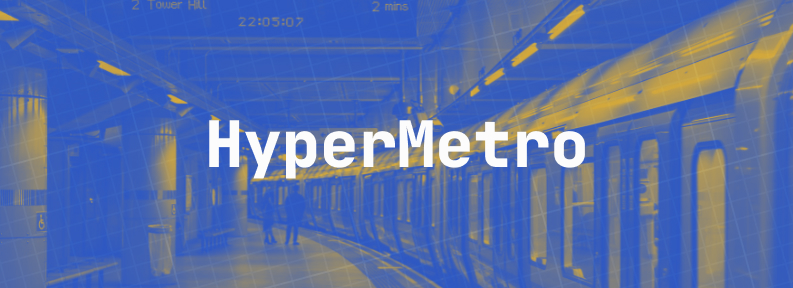
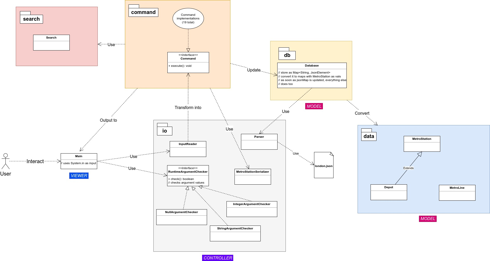

# Hyper Metro
```
Project name...........:  Hyper Metro
Completion time........:  27 days
Difficulty.............:  Hard  
Type...................:  Solo work with technical requirements + extra features for fun
Programming languages..:  Java 11 + Google GSON library  
Knowledge used.........:  MVC pattern, Command pattern, Gradle, Graphs, Trees, LinkedList, PriorityQueue, Breadth-First Search (BFS), Dijkstra Algorithm, Serialization
```

  
  
>_Living in a big city, it's hard to imagine traveling around without the help of public transport. Especially in a place like London with its rich history of the underground and vast amount of metro lines and stations. But have you ever wondered how does the app know the fastest route from one station to another? HyperMetro will make your journey a breeze and share the secrets of how route building works._
  
  
						
This is my ninth Java project and the heaviest one to date - it took me almost a month to finish it. This is a project from JetBrains Academy. Working on HyperMetro I've got acquainted with directed weigthed graphs and just graphs in general - one of most essential data structures. I have also learned and implemented two graph traversing algorithms - **breadth-first search** and **Dijkstra algorithm** using LinkedLists and PriorityQueues, utilized Google's GSON library to deal with JSON files, briefly used Gradle, exercised usage of design patterns and got a taste of dealing with constantly changing technical requirements.

Doing this project was a wake up call to take GitHub more seriously. I've got stuck when trying to apply a new file structure to an existing repo with this project, so instead I had to make a new one because I couldn't figure it out. That's really bad. Knowing just a couple of commands won't cut it anymore. Regardless, I'm happy how HyperMetro turned out. So far, the app supports 19 different commands. Go ahead and give it a try. Use London's map as a reference. You can find it in `data/` folder. I do not own this image.

## What I've learned ##
- what are graphs and trees and how to implement them in Java
- two graph traversal algorithms: breadth-first search and Dijkstra algorithm and how to implement them in Java
- how GSON makes it easy to serialize / deserialize Java objects
- how to implement Command Pattern
- how to use Gradle to pack a program into jar file
- the importance of good software design decisions
- how rapidly technical requirements can change - JSON format has been changed a few times along the way

## Technical requirements
- Load metro file from JSON file as an argument
- Find shortest route (route with least amount of hops) between two stations
- Find fastest route between two stations
- Basic station creation functionality: add new head or tail stations to the metro line
- Print metro line to the user
- Print shortest time needed to travel from any metro station to other metro stations
- Print metro station and its adjacent metro stations to display in a train car

**As a challenge, I've added the following functionality on my own:**
- Import and export metro file
- Enable / disable metro station when it is under maintenance
- Find metro station by its name or part of its name
- Find all possible routes from one station to another station
- Dynamically read arguments that are passed to the program
- Print full info about metro line and metro station
- Find and print cycles _within a line_
- Add shorthands to commands

## UML Diagram


## List of commands

**DATA IMPORT / EXPORT**

`loadmetro`, `load`, `import` - Load metro from a file in data/ folder. Enforce connectivity flag ensures there are no one-sided connections in file. Possible values: true, false.  
Usage: /loadmetro \<file name\> \<enforce connectivity flag\>  
  
`savemetro`, `save`, `export` - Save metro to data/ folder. If folder doesn't exist, it will be created.  
Usage: /savemetro \<file name\>  
  
`exit`, `quit`, `q`, `e` - Exit program.  
Usage: /exit

**METRO STATION CONTROL**

`append`, `addhead`, `ah` - Append (add as head) new station to a metro line. A head is a metro station that doesn't have any next stations.  
Usage: /append \<line name\> \<station name\> \<time\>

`prepend`, `addtail`, `at` - Prepend (add as tail) new station to a metro line. A tail is a metro station that doesn't have any previous stations.  
Usage: /prepend \<line name\> \<station name\> \<time\>

`enable`, `open` - Enable metro station for use (stop maintenance).  
Usage: /enable \<line name\> \<station name\>

`disable`, `maintenance` - Disable metro station for use (start maintenance). Routes calculation commands won't use this station when it's disabled.  
Usage: /disable \<line name\> \<station name\>

**INFORMATION**

`help`, `commands`, `h` - Print this help message.  
Usage: /help

`output`, `out`, `o` - Print station and its adjacent stations (for use in car displays).  
Usage: /output \<line name\> \<station name\>

`metro`, `m`- Print metro.  
Usage: /metro

`metroinfo` - Print metro info.  
Usage: /metroinfo

`lineinfo`, `line`, `l` - Print metro line info.  
Usage: /lineinfo \<line name\>

`stationinfo`, `info`, `si` - Print metro station info.  
Usage: /stationinfo \<line name\> \<station name\>

`findstation`, `find`, `fs` - Search for a station by its name. Case sensitive.  
Usage: /findstation \<search term\>

`fastestroutes`, `frs` - Print fastest times from metro station to all other metro stations. Uses Dijkstra algorithm.  
Usage: /fastestroutes \<line name\> \<station name\>

**ROUTES**

`cycles`, `cy` - Print cycles found in each line of current metro. Uses variation of BFS algorithm.  
Usage: /cycles

`routes`, `r` - Find and print all possible routes between two stations if before timeout is reached (default=10sec). Uses variation of BFS algorithm.  
Usage: /routes \<line from name\> \<station from name\> \<line to name\> \<station to name\> \<max route length\>

`route`, `ro` - Find and print route between two stations with least amount of hops. Transfer to another line is not considered as a hop. Uses BFS algorithm.  
Usage: /route \<line from name\> \<station from name\> \<line to name\> \<station to name\>

`fastestroute`, `fr`- Find and print fastest route between two stations. Uses Dijkstra algorithm.  
Usage: /route \<line from name\> \<station from name\> \<line to name\> \<station to name\>

## List of arguments
`-metro <file>` - load custom metro file. (default: london.json)  
`-ttime <time in mins>` - define custom transfer time (default: 5)  
`-timeout <time in ms>` - define custom timeout before finding all routes command gives up (default: 10000ms)  
`-enforce` - enforce connectivity between stations - read one-sided connections in JSON file as two sided connections (default: false)    

## How to run
Clone this repo and run hypermetro.jar in `dist/` folder with `java -jar hypermetro.jar`.
